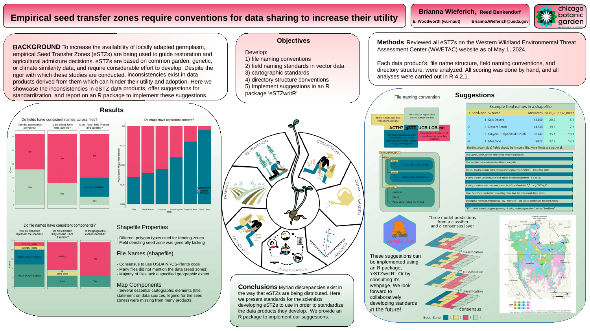

<!-- README.md is generated from README.Rmd. Please edit that file -->

# eSTZwritR (‘easy rider’) 

# Description

An R package for applying standardized file naming, directory structure,
mapping, and metadata conventions to empirical Seed Transfer Zones
(eSTZs).

## Overview

The goal of this package is to standardize eSTZ documentation to
accelerate the sharing of these resources among natural resource
professionals.

## :arrow_double_down: Installation

eSTZwritR is available only on github. It can be installed using
`remotes` or `devtools` like so:

    install.packages('devtools')
    devtools::install_github('sagesteppe/eSTZwritR')

Once installed it can be attached for use like any other package from
github or CRAN

    library(eSTZwritR)

## Usage

eSTZwritR requires only five user-facing functions to implement all data
sharing conventions.

| Function | Purpose | Output |
|:--:|:--:|:--:|
| regionCoding | determine DOI Regions | Character string for file naming |
| dirmakR | create Directory | Directory, spatial data |
| mapmakR | create Map | PDF or png map (for publications) |
| fieldsmakR | ensure fields (columns) are named | sf object to local location |
| orderZones | ordering seed zone numbers | updated vector data, plot, summary |

## Documentation

A paper describing the impetus behind the creation of eSTZwritR, and
broadly outlining it’s functionality is available
[here](https://github.com/sagesteppe/EmpiricalSeedZones/blob/main/manuscript/Empirical-seed-transfer-zones-require-conventions-for-data-sharing-to-increase-their-utilization-by-practitioners.pdf).

A poster on the project for the National Native Seed Conference 2025 is
available here

<figure>

<figcaption aria-hidden="true">Seed Zone Poster</figcaption>
</figure>

A vignette showcasing the usage of the package is available
[here](https://sagesteppe.github.io/eSTZwritR/articles/eSTZwritR.html).

## Citation

Wieferich, B., Benkendorf, R.C. 2024. eSTZwritR

A bibtex entry for latex users is:

@Misc{wieferich2024estz,  
title = {eSTZwritR},  
author = {Wieferich, B and Benkendorf R.C.},  
year = {2024},  
url = {<https://github.com/sagesteppe/eSTZwritR>},  
}

Or use R to display citations using

    citations('eSTZwritR')
