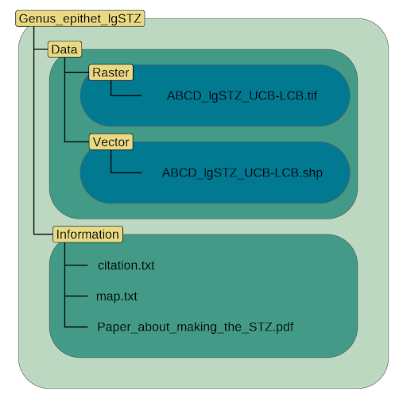
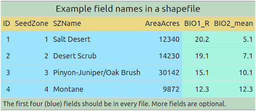
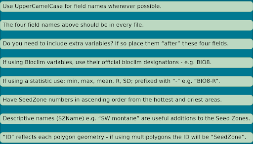

```{r, include = FALSE}
knitr::opts_chunk$set(
  collapse = TRUE,
  comment = "#>"
)
```

`eSTZwritR` is available only on github. 
It can be installed using the `remotes` or `devtools` packages. 
Users from different operating systems (e.g. Mac and Windows) have differing success with the above two packages in general. 
If one package is not easy for the install, perhaps try the other. 

```{r Installation, eval = F}
# install.packages('devtools')
devtools::install_github('sagesteppe/eSTZwritR')

#install.packages('remotes') 
#remotes::install_github('sagesteppe/eSTZwritR')
```

We will also load the core tidyverse packages for assorted data handling tasks. 
```{r setup, message = FALSE}
set.seed(5)
library(eSTZwritR)
library(tidyverse)
library(sf)
library(patchwork)
```

Here we will load in the example data we will use for all steps of the vignette. 
These data are from ... 
They represent a rather complex eSTZ, composed of many polygons. 

```{r import example data}
acth7 <- sf::st_read(file.path(
   system.file(package="eSTZwritR"), "extdata", 'ACTH7.gpkg')
)
```

We will perform a few minor alteration on this data set which you may find useful in your own workflow. 

```{r clean up data product}

# This step was already run during creation of the package. simple feature 
# geometries have certain rules about what constitutes a valid geometry. One
# of the most important rules (or at least the most violated) is that a polygon 
# should not cross itself. We can easily fix that and several other types of
# errors using sf::st_make_valid() - this should be a common part of any spatial 
# analysts workflow.
acth7 <- sf::st_make_valid(acth7)

# We also want to ensure that spatially contiguous polygons of the same seed zone
# are merged. This allows for more accurate assessments of the area covered by 
# each seed zone in traditional data.frame/tibble type calculations. It also 
# allows us to provide a unique ID to each polygon. 

polygonsStart <- nrow(acth7)
acth7 <- acth7 |>
  # first we define a grouping variable, all polygons from these levels will be combined
  group_by(zone) |>
  # now we union (or dissolve) all polygons by the levels specified above, into
  # one multipolygon object per level. 
  summarise(geom = st_union(geom)) |>
  # now we split apart the multipolygon into contiguous pieces. 
  st_cast('POLYGON') |>
  # just making sure everything goes OK. 
  st_make_valid()

polygonsEnd <- nrow(acth7)
message('\nThis data set now has: ', polygonsStart - polygonsEnd, ' fewer polygons')

# You'll notice we lost some info! 
# We lost columns containing the GRIDCODE - this is from when the data were converted
# from raster, area_ha, and ID for each polygon. The area_ha can be recalculated, 
# and we can create new ID's for the polygons. We could use a left join to get the
# GRIDCODE back on. BUT take this is a lesson, some of these polygon geometry 
# maintenance steps should be done early! Realistically before many analysis in 
# the paper are done perhaps! We'll show you how to make some new IDs and 
# calculate the areas again. 

acth7 <- mutate(acth7, ID = 1:nrow(acth7), .before = 1)

# we can calculate the area like this
acth7 <- sf::st_transform(acth7, 5070) # we will put the data into an Equal area projection
# this type of projection minimizes the distortion of area. 

# now we calculate the area using geodesic_areas (accounting for the curvature of the earth)
# we then convert the data into 'hectares' and will then drop some data attributes. 
# see ?units for more info. 
acth7 <- mutate(acth7, area_ha = 
                  as.numeric(
                    units::set_units(
                      st_area(acth7), "hectare")), .before = geom)

# here we go! geodesic areas calculated from an equal area projection! This should
# be pretty well representative of how large each polygon is. 

# now we will convert these data back to geographic coordinates system WGS84
acth7 <- sf::st_transform(acth7, 4326)

rm(polygonsStart, polygonsEnd)
```

### Region Coding

The first step in using the package is determining which Department of Interior regions the data product is mostly associated with. 
The zones listed on the file will not be comprehensive, as we restrict the number of listed areas to two zones. 
However, they should give an OK indication of roughly the spatial extent which the data product covers. 
```{r Region Coding, message = F}
rc <- regionCoding(acth7)

str(rc) # the returned data is a list of two objects, a vector and a data frame. 

# Either format works to extract the data from the list.
rc$SuggestedName == rc[['SuggestedName']] 
# I use this method (less typing), even though I like the look of the other method more... 
rc$SuggestedName 
```
The `SuggestedName` vector contains the name which the function proposes to use

We can look at the regions (well very small ones may be missed) which our seed transfer zones is across by looking at the second item in our list `RegionsCovered`. 

```{r Region Coding Table}
knitr::kable(rc$RegionsCovered)
```

We see that we mostly cover the CBG region and CPN region, with some more coverage of the UCB region. 

### orderZones 
The zones from a variety of data products have either no implicit ordering, or rather complex ordering. 
In these situations it can be difficult to determine which zones are in geographic and environmental proximity to each other. 
We have a function which users a very simple method to suggest an order for numbering the seed transfer zones in these instances. 
It will take a little bit of time to run, here we have the number of points used in calculating the order set to a low value, I encourage you to increase this value (to say 5000) when actually determining an order before distributing a data set. 

```{r orderZones}
oz <- orderZones(acth7, SeedZone = zone, n = 1000)

# oz$Summary # i use kable so this looks nice online, just run oz$Summary to print to console. 
knitr::kable(oz$Summary)
```

Obviously, we can always get an order from the seed zones - but is there actually any merit to this order? 

```{r orderZones KruskalWallis, message = FALSE}
oz$PlotKruskal
```
We can check that with the results from a Kruskal-Wallis test implemented using ggpubr. 
First visual impressions give an indication that a trend is present throughout the data, but that the differences between some groups appears negligible. 
So while a global trend exists, under a magnifying lens, relationships are more nuanced. 
In my opinion, the global trend is evidence enough, that using an ordering criterion like this is useful for simply trying to make *some* sense of categorical features. 
The results of the Kruskal-Wallis test (or one-way ANOVA on ranks) indicates that there is strong evidence that at least one group differs from the others, i.e. they were not drawn from the same distribution. 

```{r orderZones Dunns, message = FALSE}
oz$PlotDunns
```
In this squished plot what we have depicted are the results from pairwise comparisons of all seed transfer zones using a Dunn's test, with Holm's p-adjustment method for multiple comparisons.
If a line is missing between two groups, that indicates that a p-value of > 0.05 exists between the groups, showing little to no evidence of differences between them. 
The presence of the line indicates that a p-value beneath 0.05 is present, see ??stat_pwc for details on the coding. 
Our post-hoc test shows that the groups on either end of the aridity spectrum differ from each other. 
However, there is little evidence that the groups in the center of the spectrum differ from one another. 
Further there is no evidence that the more humid groups differ from one another. 

To reiterate my initial impression from these plots, a continuum exists between the seed transfer zones. 
Some zones are markedly different from others, but most of them are able to run into each other. 

Finally, we can make some maps and see how our seed zones differ on them - is their any intuitive sensibility here? 

```{r Maps of Ordered Seed Zones, message = F}
p1 <- ggplot(data = acth7, aes(fill = zone)) + 
  geom_sf() + 
  theme_void() + 
  scale_fill_distiller(palette = "RdYlGn", direction = 1) + 
  labs(title = 'Original')

p2 <- ggplot(data = oz$Reclassified, aes(fill = zone)) + 
  geom_sf() + 
  theme_void() + 
  scale_fill_distiller(palette = "RdYlGn", direction = 1) + 
  labs(title = 'Ordered')

p1 + p2
rm(p1, p2)
```

The differences are not very loud, given the difficulty of interpreting habitat in the basin and range province, but they showcase a general trend from the more arid southern reaches, towards the more humid areas along the mountains of central Oregon. 


*Note that this function uses Kruskal-Wallis tests by default, even though in this case we could probably swing an ANOVA due to the high number of groups, and high number of data points per group we were able to generate.* 
*This particular eSTZ example was chosen because it is a bit more complex than other products, and we don't think swapping to an ANOVA in this function is warranted.* 

```{r, echo = FALSE}
rm()
```

### Directory (Folder) Structure


```{r, eval = F}
dirmakR()
```


### File Naming 

### Maps 

```{r, eval = F}
mapmakR()
```


### Data Formats 

### Vector Data Field Attibutes. 





```{r, eval = F}
fieldsmakR()
```

### Metadata 
